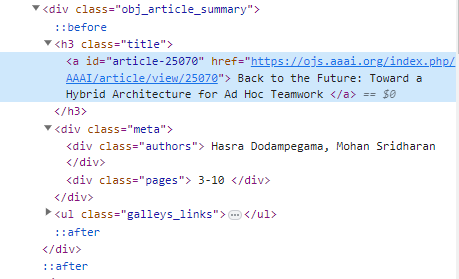

## Parse website

- We parse the AAAI website links using **requests** and **BeautifulSoup** in [2023-AAAI.ipynb](./2023-AAAI.ipynb). The AAI 2023 proceddings have 11 tracks, from `https://ojs.aaai.org/index.php/AAAI/issue/view/548` to `https://ojs.aaai.org/index.php/AAAI/issue/view/558`. 

- We get the content as follows. You can set `proxies` as `None` if your internet is OK.
```python
# Define the proxy
proxy = {
    'http':  'socks5h://localhost:7890',
    'https': 'socks5h://localhost:7890',
}
resp = requests.get(link, proxies=proxy)
soup = BeautifulSoup(resp.content, 'html.parser')
```

- We get the articles and their corresponding titles and authors as follows. 
```python
articles = soup.find_all('div', class_='obj_article_summary')
titles, authors = [], []
for art in tqdm(articles):
    title = art.h3.get_text(strip=True)
    author = art.find_all('div', class_='authors')[0].get_text(strip=True)
    titles.append(title)
    authors.append(author)
```

- You can parse your specific procedding type by `F12` to check the CSS style. The CSS class of `article` is `obj_article_summary`, the CSS class of `title` is `title`, and the CSS class of `author` is `authors`.
  

